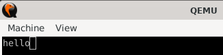

# infinite loop

Assemble the `loop.s` source file into the `loop.o` object file:

```sh
riscv64-elf-as -march rv64i -mabi lp64 -o loop.o loop.s
```

Link the `loop.o` object file using the `loop.ld` linker script. This creates the `loop` RISC-V ELF binary:

```sh
riscv64-elf-ld --script loop.ld -o loop.elf --verbose loop.o
```

Execute the `loop` RISC-V ELF binary with QEMU:

```sh
qemu-system-riscv64 -cpu rv64i -machine virt -bios loop.elf
```

In QEMU, click `View` > `serial0` and you should see the text `hello` printed to the screen.



## Explanation

Here is an explanation of the most important instructions in the `loop.s` file.

### Assembler directives

```asm
.section .text.bios
.globl _start
.equ UART0, 0x10000000
```

The `.section` [assembler directive](https://michaeljclark.github.io/asm.html) specifies in which **section of the object file** `loop.o` the code or data of the lines below will be placed in.

The `.globl` directive requires a symbol name as an argument, and emits that symbol name to the **global symbol table**.

These two instructions together mean that the symbol `_start` will be emitted in the symbol table of the `.text.bios` section of the object file `loop.o`, and that it will be visible outside of the object file `loop.o`.

You can double check using the following command:

```sh
riscv64-elf-objdump -t -j .text.bios loop.o
```

You should get this output:

```sh
loop.o:     file format elf64-littleriscv

SYMBOL TABLE:
0000000000000000 l    d  .text.bios     0000000000000000 .text.bios
000000000000002c l       .text.bios     0000000000000000 loop
0000000000000000 g       .text.bios     0000000000000000 _start
```

As you can see, the `_start` symbol is global (`g`), so it's available to other object files.
On the other hand, the `loop` symbol is local (`l`), so it's not visible outside.

The QEMU RISC-V VirtIO Board maps UART0 at the memory address `0x10000000` ([source code here](https://github.com/qemu/qemu/blob/ffeddb979400b1580ad28acbee09b6f971c3912d/hw/riscv/virt.c#L82C6-L82C16)). To avoid leaving a [magic number](https://en.wikipedia.org/wiki/Magic_number_(programming)) in the source code, we define a constant using the `.equ` directive.

### Initialize `a1`

The instruction `li a1, UART0` means that we use the `a1` register to store the current state of UART0. `li` is a RISC-V [pseudo-instruction](https://github.com/riscv-non-isa/riscv-asm-manual/blob/main/riscv-asm.md#-a-listing-of-standard-risc-v-pseudoinstructions) that loads an immediate value (a constant) into a register.

### Write to the memory address pointed by `a1`

The [RISC-V Calling Convention](https://riscv.org/wp-content/uploads/2015/01/riscv-calling.pdf) states that registers `a0` and `a1` can be used for function arguments and return values:

> Values are returned from functions in integer registers a0 and a1 and floating-point registers fa0 and fa1.
  
Also, RISC-V reserves a register `x0` that is [hardwired to zero](https://en.wikichip.org/wiki/zero_register).

The instruction `addi a0, x0, 0x68` means adding `0x68` (the [Hex ASCII code](https://www.ascii-code.com/) for the letter `h`) to the value in register `a0`.

In RISC-V assembly language, the brackets around a register in a memory instruction indicate that the register contains a memory address.

The instruction `sb a0, (a1)` stores the least significant byte of the value found in `a0` (i.e. `0x68`) into the memory location pointed to by `a1`.

### ELF analysis

Command:

```sh
file loop.elf
```

Output:

```sh
loop.elf: ELF 64-bit LSB executable, UCB RISC-V, soft-float ABI, version 1 (SYSV), statically linked, not stripped
```

Command:

```sh
readelf --symbols loop.elf
```

Output:

```sh
Symbol table '.symtab' contains 8 entries:
   Num:    Value          Size Type    Bind   Vis      Ndx Name
     0: 0000000000000000     0 NOTYPE  LOCAL  DEFAULT  UND
     1: 0000000080000000     0 SECTION LOCAL  DEFAULT    1 .text
     2: 0000000000000000     0 SECTION LOCAL  DEFAULT    2 .riscv.attributes
     3: 0000000000000000     0 FILE    LOCAL  DEFAULT  ABS loop.o
     4: 0000000010000000     0 NOTYPE  LOCAL  DEFAULT  ABS UART0
     5: 0000000080000000     0 NOTYPE  LOCAL  DEFAULT    1 $xrv64i2p1
     6: 000000008000002c     0 NOTYPE  LOCAL  DEFAULT    1 loop
     7: 0000000080000000     0 NOTYPE  GLOBAL DEFAULT    1 _start
```

## Credits

- [Bare metal programming with RISC-V guide](https://popovicu.com/posts/bare-metal-programming-risc-v/)
- [Foundations of RISC-V Assembly Programming (edX)](https://learning.edx.org/course/course-v1:LinuxFoundationX+LFD117x+2T2024/home)
